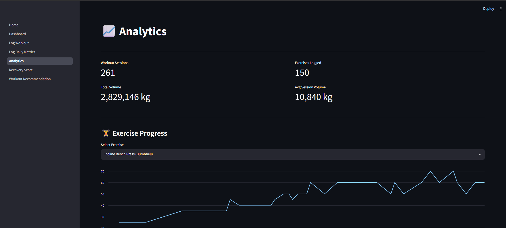
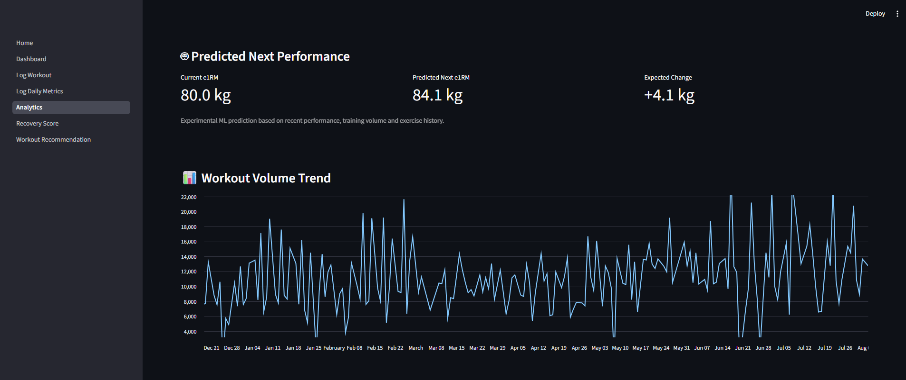
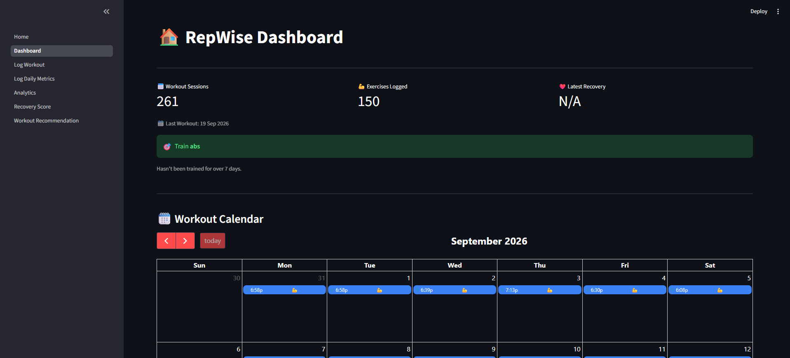
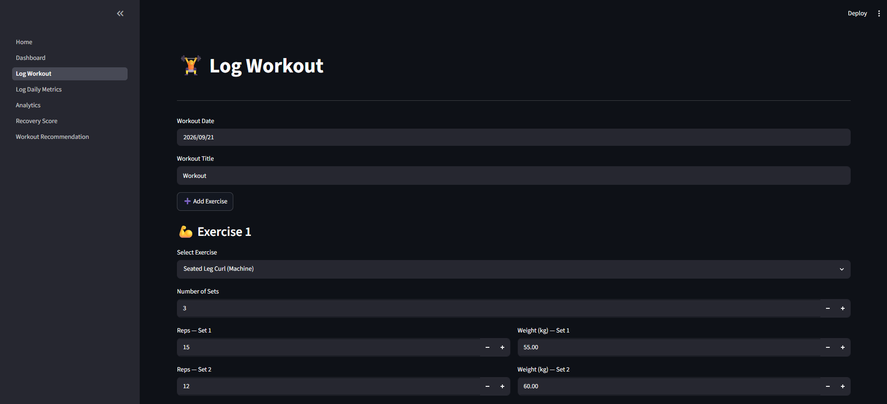
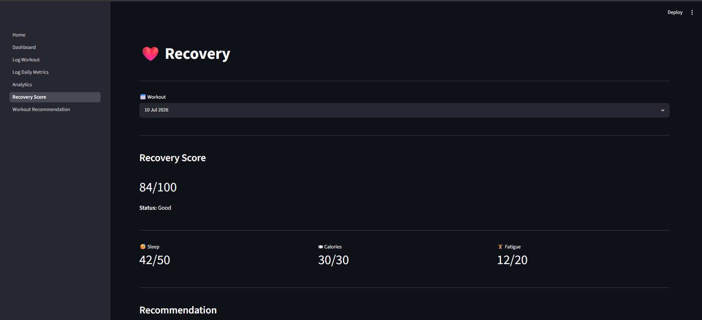
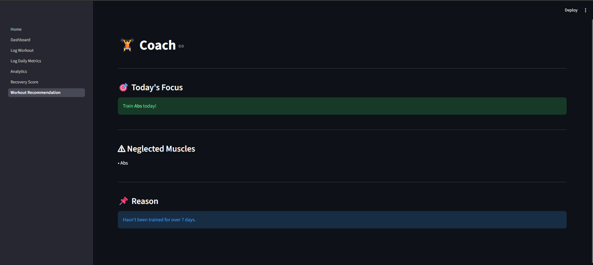

# RepWise

RepWise is a modular Python fitness analytics application that combines workout logging, recovery analysis, rule-based recommendations, and a first machine-learning performance prediction pipeline.

The project uses **SQLite** for persistent storage, **Pandas** for analytics and feature engineering, **scikit-learn** for ML, and **Streamlit** for the user interface.

---

## Why I Built This

I built RepWise to combine my interest in fitness with software engineering, data analysis, and machine learning.

The project started as a workout logger and gradually evolved into a complete data pipeline:

```text
Workout Logging
      ↓
SQLite Database
      ↓
Analytics & Recovery
      ↓
Recommendation Engine
      ↓
ML Feature Engineering
      ↓
Next-Session e1RM Prediction
      ↓
Streamlit Inference
```

The goal is not only to build a fitness tracker, but to understand how a real ML-enabled application is designed, evaluated, and integrated end-to-end.

---

## Current Features

### 🏋️ Workout Logging

- Log workouts with exercises, sets, reps, and weight
- Log daily metrics including sleep, calories, and bodyweight
- Automatic personal-record detection
- Multiple PRs supported within one workout
- Chronological workout-session storage
- Manual logging backed by SQLite

### 📊 Dashboard

- Workout overview and key statistics
- Interactive workout calendar
- Clickable workout history
- Detailed session breakdowns
- Recent workout summaries
- Recovery and recommendation previews

### 📈 Analytics

- Total workout sessions
- Total exercises logged
- Total workout volume
- Average session volume
- Exercise progress graphs
- Workout-volume trend
- Bodyweight trend
- ML-based next-performance prediction

### 🧠 Recovery System

RepWise calculates a **0–100 recovery score** using:

- Sleep
- Calorie intake
- Bodyweight
- Relative workout fatigue
- Historical workout volume

The fatigue component compares the current session against the previous training history rather than relying on fixed workout-volume thresholds.

The recovery system also:

- handles insufficient workout history
- scales the remaining score when fatigue history is unavailable
- supports rest days
- provides recovery status and training recommendations
- can analyze historical workout dates

### 🤖 Rule-Based Workout Recommendations

The recommendation engine:

- detects neglected muscles
- tracks how recently muscles were trained
- considers primary and secondary muscle involvement
- accounts for secondary-muscle fatigue
- ranks muscles by training priority
- provides reasoning behind recommendations

This rule-based system remains separate from the ML performance model.

---

# Machine Learning v0.1

RepWise now includes its first end-to-end ML pipeline.

## Problem

The current model predicts:

> **How much an exercise's estimated 1RM (e1RM) is expected to change in the next session.**

The predicted change is then converted back into a predicted next-session e1RM.

```text
Current + Historical Exercise Data
              ↓
        Feature Engineering
              ↓
      Linear Regression Model
              ↓
      Predicted e1RM Change
              ↓
Current e1RM + Predicted Change
              ↓
     Predicted Next e1RM
```

## ML Dataset

One ML row represents:

> **one exercise performed during one workout session**

Raw workout sets are aggregated into exercise-session observations before feature engineering.

Current usable ML dataset:

- **1,545 exercise-session samples**
- **1,236 training samples**
- **309 testing samples**
- chronological **80/20 train-test split**
- no random shuffling of future workout data into training

## Features

The current v0.1 model uses:

- `last_e1rm`
- `last_volume`
- `recent_avg_e1rm`
- `recent_avg_volume`
- `historical_best_e1rm`
- `days_since_last`
- `exercise_session_count`

## Target

```text
target_change = next_session_e1rm - current_e1rm
```

The final prediction is reconstructed as:

```text
predicted_next_e1rm = current_e1rm + predicted_change
```

## Model

**Linear Regression** is used as the first interpretable baseline model.

Current test-set results:

| Metric | Result |
|---|---:|
| Next-e1RM MAE | **7.54** |
| Next-e1RM RMSE | **12.00** |
| Delta R² | **0.363** |
| Naive Baseline MAE | **8.57** |

The naive baseline assumes:

```text
next-session e1RM = current e1RM
```

The ML model currently performs better than this baseline on the held-out chronological test set.

### Why Delta R²?

An earlier absolute-e1RM model produced a high R² because much of the variance came from different exercises operating on very different strength scales.

The delta target focuses evaluation on the harder problem:

> **Can the model explain session-to-session performance change?**

The model is experimental and still affected by noisy variables such as fatigue, exercise setup, rep range, technique, sleep, nutrition, and equipment differences.

---

## ML Inference in Streamlit

The trained model is saved as a model artifact and loaded by `ml/predict.py`.

The Analytics page displays:

- **Current e1RM**
- **Predicted Next e1RM**
- **Expected Change**

This creates the first complete RepWise ML workflow:

```text
Historical Workouts
      ↓
Train Model
      ↓
Save Model
      ↓
Load Model
      ↓
Select Exercise in Streamlit
      ↓
Generate Live Prediction
```

---

## Database

RepWise uses **SQLite** as its persistent relational database.

### Core Tables

- `workout_sessions`
- `exercises`
- `workout_sets`
- daily metrics
- exercise category mappings
- primary muscle mappings
- secondary muscle mappings

The database uses:

- primary and foreign keys
- referential integrity
- indexes
- transactions
- duplicate-session protection
- chronological session storage

### Hevy Import Pipeline

Historical workout data can be imported from a Hevy CSV export:

```text
Hevy CSV
   ↓
Pandas
   ↓
Validation
   ↓
Cleaning
   ↓
Chronological Sorting
   ↓
Duplicate Check
   ↓
SQLite Transaction
```

Existing workout sessions are skipped using the session key, allowing newer Hevy exports to be imported incrementally.

---

## Architecture

```text
                     ┌──────────────────┐
                     │    Streamlit     │
                     └────────┬─────────┘
                              │
                     ┌────────▼─────────┐
                     │ Application Logic│
                     └────────┬─────────┘
                              │
            ┌─────────────────┼──────────────────┐
            │                 │                  │
     ┌──────▼──────┐   ┌──────▼──────┐   ┌─────▼─────┐
     │  Analytics  │   │  Recovery   │   │    ML     │
     │  & Tracker  │   │ Recommendations│ │ Pipeline  │
     └──────┬──────┘   └──────┬──────┘   └─────┬─────┘
            │                 │                  │
            └─────────────────┼──────────────────┘
                              │
                     ┌────────▼─────────┐
                     │      SQLite      │
                     └──────────────────┘
```

UI code is kept separate from analytics, recovery, recommendation, database, and ML logic.

---

## Tech Stack

- **Python**
- **Pandas**
- **NumPy**
- **scikit-learn**
- **SQLite**
- **SQL**
- **Streamlit**
- **Matplotlib**
- **Joblib**
- **Git / GitHub**

---

## Project Structure

```text
repwise/
├── data/
│   ├── repwise.db              # Active SQLite database
│   └── workouts.csv            # Latest Hevy export / import source
│
├── database/
│   ├── connection.py           # SQLite connection management
│   ├── schema.py               # Database schema
│   └── queries.py              # Database queries
│
├── importers/
│   └── migrate.py              # Hevy → SQLite migration pipeline
│
├── ml/
│   ├── __init__.py
│   ├── dataset.py              # Exercise-session ML dataset
│   ├── features.py             # Historical feature engineering
│   ├── train.py                # Training + evaluation
│   ├── predict.py              # Live inference
│   └── models/
│       └── e1rm_delta_model.joblib
│
├── src/
│   ├── app.py                  # Streamlit entry point
│   ├── main.py                 # CLI entry point
│   ├── tracker.py              # Logging + analytics helpers
│   ├── recovery.py             # Recovery scoring
│   ├── helpers.py              # Shared utilities
│   ├── recommendation_engine.py
│   ├── exercise_database.py
│   └── pages/
│       ├── 00_Dashboard.py
│       ├── 01_Log_Workout.py
│       ├── 02_Log_Daily_Metrics.py
│       ├── 03_Analytics.py
│       ├── 04_Recovery_Score.py
│       └── 05_Workout_Recommendation.py
│
├── tools/
│   ├── test_import.py
│   └── # database inspection / testing utilities
│
├── project_docs/
│   ├── progress.md
│   └── learning.md
│
├── screenshots/
│   ├── dashboard.png
│   ├── analytics_ml.png
│   ├── workout_history.png
│   ├── recovery.png
│   └── recommendations.png
│
├── .gitignore
├── requirements.txt
└── README.md
```

---

## Screenshots

### Analytics



### ML Prediction



### Dashboard



### Workout Logging



### Recovery Analysis



### Workout Recommendations



---

## Run RepWise

Clone the repository:

```bash
git clone https://github.com/aryansachdeva1718-web/repwise.git
cd repwise
```

Install dependencies:

```bash
pip install -r requirements.txt
```

Run the Streamlit application:

```bash
py -m streamlit run src/app.py
```

### Re-import a newer Hevy export

Place the latest export at:

```text
data/workouts.csv
```

Then run:

```bash
py -m tools.test_import
```

### Retrain the ML model

```bash
python -m ml.train
```

---

## Development Roadmap

### v0.1 — Workout Logging
- workout logging
- set and exercise tracking

### v0.2 — Recovery System
- sleep and calorie analysis
- relative fatigue scoring
- recovery score

### v0.3 — Recommendation Engine
- neglected-muscle detection
- muscle priority scoring

### v0.4 — Advanced Muscle Tracking
- secondary-muscle involvement
- secondary-muscle fatigue

### v0.5 — Streamlit UI
- dashboard
- logging pages
- analytics
- recovery and recommendations

### v0.6 — SQLite Migration
- relational database architecture
- Hevy migration
- constraints, indexes, and transactions

### v0.7 — Full Database Integration
- SQLite-backed workout logging
- daily metrics in SQLite
- analytics and recovery backed by database queries
- incremental Hevy imports

### v0.8 — UI & Portfolio Polish
- improved layouts
- dashboard cleanup
- screenshots
- documentation improvements

### ML v0.1 — Performance Prediction ✅
- ML-ready exercise-session dataset
- leakage-aware historical features
- chronological train/test split
- naive baseline comparison
- Linear Regression baseline
- per-exercise diagnostics
- delta-target evaluation
- saved model artifact
- live Streamlit inference

### Next — ML v0.2
Planned work:

- research factors affecting e1RM variability
- add higher-value features
- improve data-quality checks
- investigate noisy/outlier exercises
- compare regularized linear models
- improve per-exercise evaluation
- add e1RM progression visualization
- track prediction vs actual performance over time

---

## Current Status

**Current milestone: ML v0.1 integrated**

RepWise now supports the complete workflow:

**Workout Logging → SQLite → Analytics → Recovery → Recommendations → ML Training → Model Evaluation → Live Streamlit Prediction**

The next phase focuses on improving the quality of the prediction problem and feature set rather than simply adding more complex algorithms.
